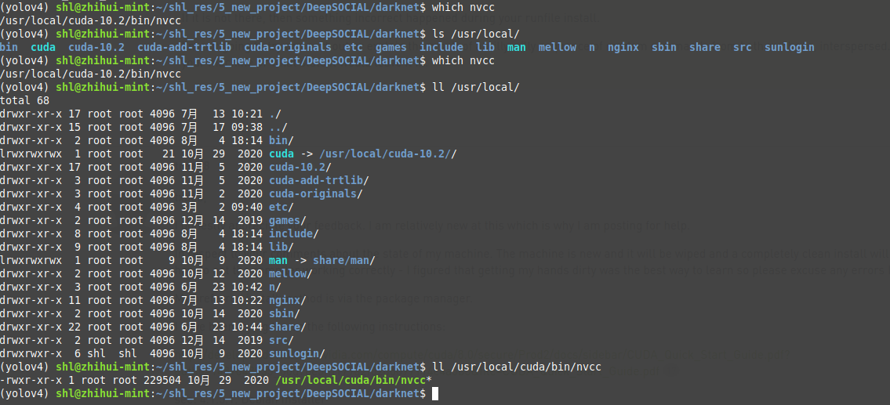
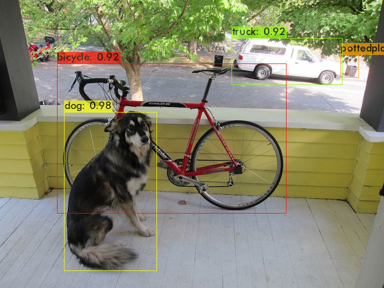

# DeepSOCIAL: Social Distancing Monitoring and Infection Risk Assessment in COVID-19 Pandemic 


**Open access paper:** https://www.mdpi.com/2076-3417/10/21/7514    &    https://doi.org/10.3390/app10217514


## 1 克隆代码和编译测试环境


### 1.1 克隆仓库代码

>`git clone `


### 1.2 编译darknet

1、先进入编译目录

```python
cd DeepSocial/darknet
```

2、根据自己是否有GPU修改`Makefile文件`

>`vim Makefile`

我修改后内容为如下：

```python
GPU=1
CUDNN=1
CUDNN_HALF=1
OPENCV=1
AVX=1
OPENMP=1
LIBSO=1
ZED_CAMERA=0
ZED_CAMERA_v2_8=0
```

3、开始编译

>`sudo make`


`注意：`

如果编译报错：`/bin/sh:nvcc not found `

解决方式（[参考](https://github.com/AlexeyAB/darknet/issues/1555)）：

1）查看nvcc可执行文件的路径

>`which nvcc`


2）修改`Makefile`文件中的`NVCC=nvcc`，把`nvcc`替换为上面查询到的`nvcc可执行文件的路径`

>`NVCC=/usr/local/cuda/bin/nvcc`





4、验证环境

验证环境有两种方式：

- 使用编译的`darknet可执行文件`
- 使用`darknet接口API`


使用编译的`darknet可执行文件`

>`./darknet detector test ./cfg/coco.data ./cfg/yolov4.cfg ../weights/DeepSocial.weights data/dog.jpg -i 0 -thresh 0.25`


- 使用`darknet接口API`

>`python image_yolov4.py`


环境如果没有问题，你会看如如下如的预测结果：




## 2 程序运行


1、下载测试视频，测试视频放到`DeepSocial/Images`目录下

- [OxfordTownCentreDataset.avi视频下载地址](https://pan.baidu.com/s/1lEKxwrbbu17QPmPLNYDP3Q)：提取码`3v10`


用到的测试数据是`牛津市中心（Oxford Town Center）`采集的一段视频，`5分钟的长度`


2、下载预训练的模型，下载模型放到`weights`目录下

- [预训练模型DeepSocial.weights的下载地址](https://pan.baidu.com/s/1CyS0fcqkTWsqSA2l6hr8FA)：提取码`m4k9`


3、运行测试程序

>`python Yolov4_DeepSocial.py`


测试效果如下：


 


